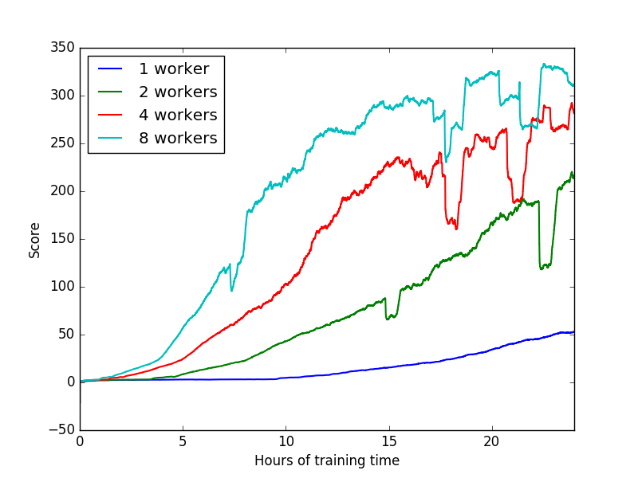
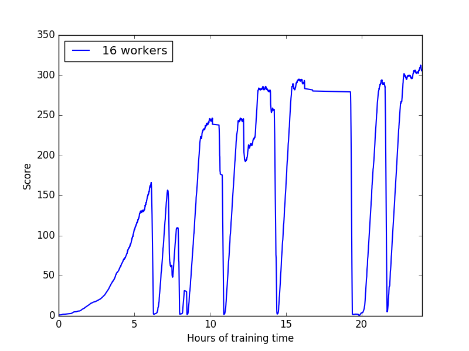
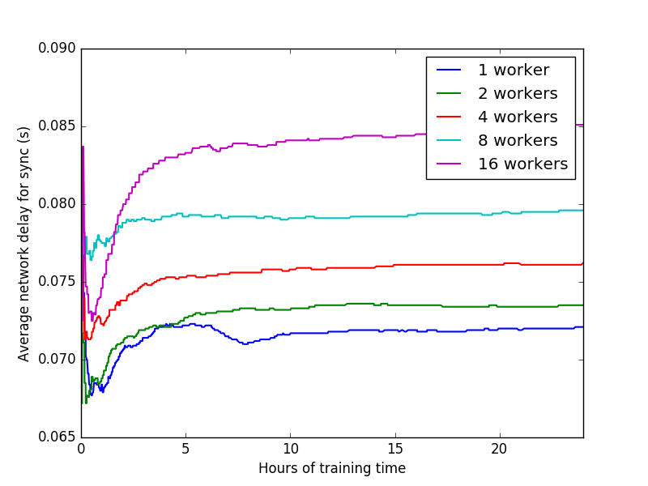

# A3C with distributed TensorFlow

## Description
Distributed TensorFlow implementation of ["GA3C"](https://openreview.net/forum?id=r1VGvBcxl). Training is multi-node, asynchronous and uses the "Between-graph replication" approach. The parameter server nodes hold the variables of the globally shared A3C network. Each worker node maintains a local A3C network, which is updated by k (~64) local agents. Each local network is brought in sync with the global network at a certain (configurable) frequency.

## Running the code
The code has been tested with ```aprun```, which is a Cray Linux Environment utility to launch processes on compute nodes. A sample command to run async training with 1 ps-job and 8 worker-jobs is below. The code uses ```mpi4py``` python package to create a TF cluster specification. 

```
NP=1  # number of parameter server nodes
NW=8  # number of worker nodes
NT=9  # total MPI ranks (NP + NW)
aprun -n $NT -N 1 -d 16 -cc none python3.4 GA3C.py -np $NP -nw $NW 
```

## Plots

#### Learning curves 
This shows scaling from 1 to 8 worker nodes for ATARI ```Breakout```, keeping the number of parameter server nodes to 1. 



This shows scaling to 16 worker nodes. The performance is unstable, possibly due to a large learning rate (3e-4). Intuitively, the learning rate should be decreased for high cluster count since per-node gradient contribution to the shared model becomes more noisy.



#### Network Traffic
This plots the average time for the sync step between a local and the global A3C network as training progresses. The average time increases from ~70ms (1 worker, 1 ps) to ~85ms (16 workers, 1 ps). 


